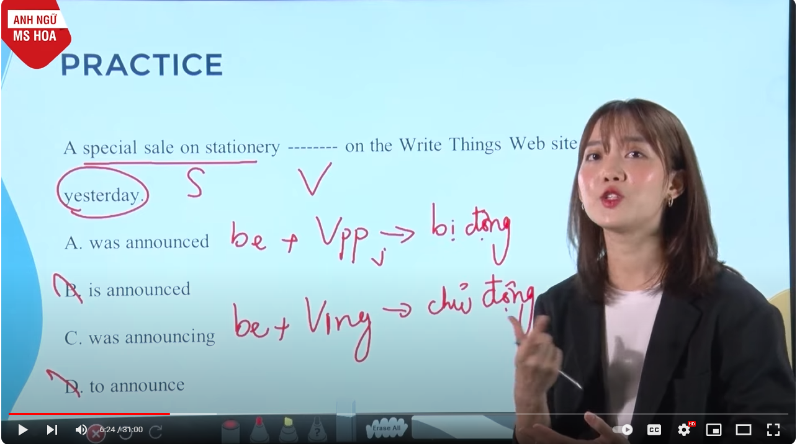

# xác định câu chủ - bị động

## Câu bị động - câu chủ động

Với câu có tân ngữ -> câu chủ động

She made **coffee** for us.

Với câu không có tân ngữ -> có thể là câu bị động

The coffee is already made

<figure><figcaption>
từ sau on (là thông tin thêm về thời gian và địa điểm)
</figcaption></figure>

